# Perdoo

[](https://pypi.python.org/pypi/Perdoo/)
[](https://pypi.python.org/pypi/Perdoo/)
[](https://pypi.python.org/pypi/Perdoo/)
[](https://opensource.org/licenses/MIT)

[](https://github.com/j178/prek)
[](https://github.com/astral-sh/ruff)
[](https://github.com/astral-sh/ty)

[](https://github.com/Buried-In-Code/Perdoo/actions/workflows/linting.yaml)
[](https://github.com/Buried-In-Code/Perdoo/actions/workflows/testing.yaml)
[](https://github.com/Buried-In-Code/Perdoo/actions/workflows/publishing.yaml)

Perdoo helps organise comic collections using metadata stored within comic archives.

It standardises digital comics into a consistent format and can add or update metadata using supported services.

Unlike fully automated tagging tools, Perdoo takes a manual approach when metadata is unavailable. When necessary, it prompts for Publisher, Series, and Issue details that can be used to search supported metadata services.

## Installation

### Pipx

1. Ensure [Pipx](https://pipx.pypa.io/stable/) is installed:

   ```console
   pipx --version
   ```

2. Install Perdoo:

   ```console
   pipx install perdoo
   ```

## Usage

<details>
<summary><code>perdoo</code> commands</summary>

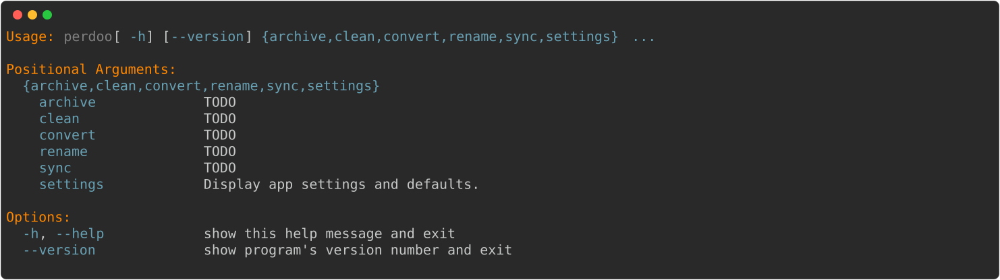

<details>
<summary><code>perdoo archive</code> commands</summary>

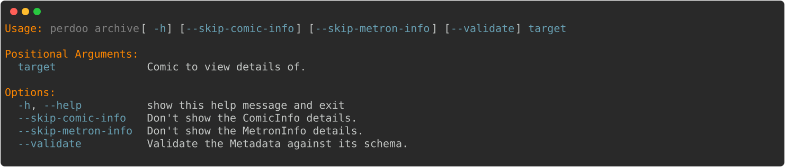

<details>
<summary><code>perdoo archive comic-info</code></summary>

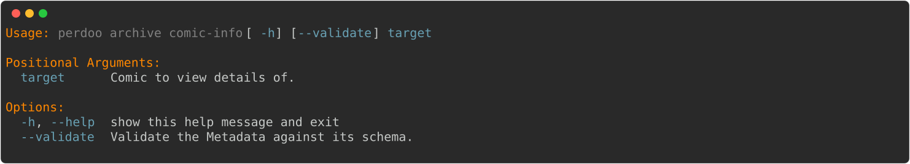

</details>

<details>
<summary><code>perdoo archive metron-info</code></summary>

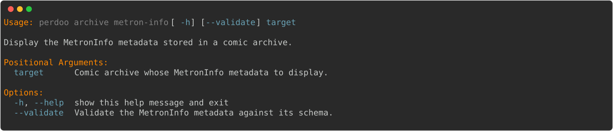

</details>

<details>
<summary><code>perdoo archive remove</code></summary>

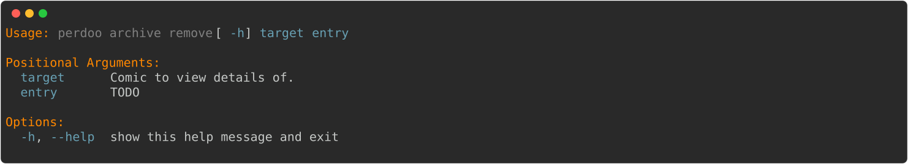

</details>

<details>
<summary><code>perdoo archive tree</code></summary>

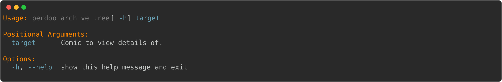

</details>

</details>

<details>
<summary><code>perdoo clean</code></summary>

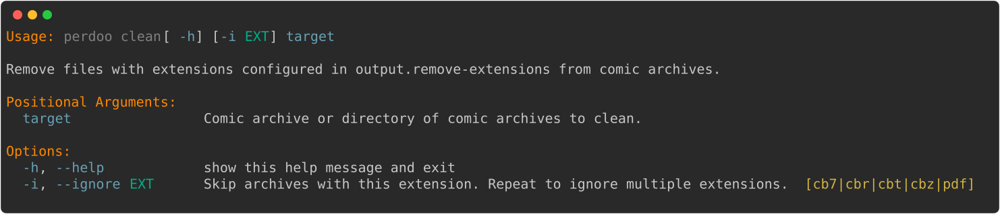

</details>

<details>
<summary><code>perdoo convert</code></summary>

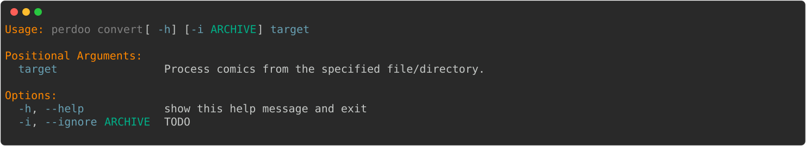

</details>

<details>
<summary><code>perdoo rename</code></summary>

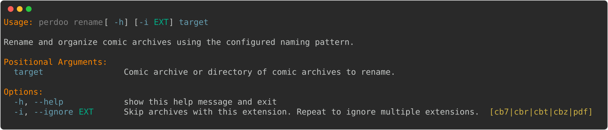

</details>

<details>
<summary><code>perdoo settings</code></summary>

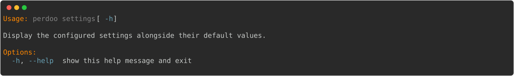

</details>

<details>
<summary><code>perdoo sync</code></summary>

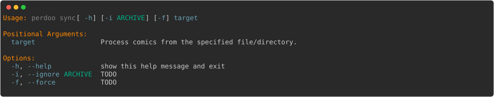

</details>

</details>

## Supported Formats

| Format | Input | Output |
| ------ | :---: | :----: |
| CB7    |  ✅   |   ✅   |
| CBR    |  ✅   |   ❌   |
| CBT    |  ✅   |   ✅   |
| CBZ    |  ✅   |   ✅   |
| PDF    |  ✅   |   ❌   |

### Metadata Files

Metadata file support is provided by [shortbox](https://codeberg.org/buriedincode/shortbox), which currently supports:

- ComicInfo v2.0 (with field ordering ignored)
- MetronInfo v1.1

## Services

- [Comicvine](https://comicvine.gamespot.com) using the [Simyan](https://github.com/Metron-Project/Simyan) library.
- [Metron](https://metron.cloud) using the [Mokkari](https://github.com/Metron-Project/Mokkari) library.

## File Renaming and Organization

Perdoo uses a pattern-based approach for naming and organizing files.

Metadata is taken from MetronInfo when available, with ComicInfo used as a fallback.

The default pattern is:

```text
{publisher-name}/{series-name}-v{volume}/{format}/{series-name}-v{volume}_#{number:3}
```

### Pattern Options

#### Padding

Integer and integer-like fields, such as `{number}`, support optional zero-padding by specifying a length.

For example: `{number:3}` produces `012` from `12`

#### Sanitization

Metadata values are sanitized to remove characters outside:

```text
0-9a-zA-Z&!-
```

Custom characters can still be added directly to patterns.

### Pattern Keys

| Pattern Key          | Description                                                              |
| -------------------- | ------------------------------------------------------------------------ |
| `{cover-date}`       | The issue cover date in `yyyy-mm-dd` format.                             |
| `{cover-day}`        | The day from the issue cover date.                                       |
| `{cover-month}`      | The month from the issue cover date.                                     |
| `{cover-year}`       | The year from the issue cover date.                                      |
| `{format}`           | The full format name of the series.                                      |
| `{id}`               | The primary ID of the issue.                                             |
| `{imprint}`          | The publisher's imprint.                                                 |
| `{isbn}`             | The issue's ISBN.                                                        |
| `{issue-count}`      | The total number of issues in the series.                                |
| `{lang}`             | The issue's language.                                                    |
| `{number}`           | The issue number.                                                        |
| `{publisher-id}`     | The publisher's unique ID.                                               |
| `{publisher-name}`   | The full name of the publisher.                                          |
| `{series-id}`        | The series' unique ID.                                                   |
| `{series-name}`      | The full name of the series.                                             |
| `{series-sort-name}` | Sort-friendly series name, omitting leading words such as "The" and "A". |
| `{series-year}`      | The year the series started.                                             |
| `{store-date}`       | The issue store date in `yyyy-mm-dd` format.                             |
| `{store-day}`        | The day from the issue store date.                                       |
| `{store-month}`      | The month from the issue store date.                                     |
| `{store-year}`       | The year from the issue store date.                                      |
| `{title}`            | The issue title.                                                         |
| `{upc}`              | The issue's UPC.                                                         |
| `{volume}`           | The volume of the series.                                                |

## Settings

Perdoo's settings are stored in:

```text
~/.config/perdoo/settings.toml
```

The file is created automatically on first run.

### Example

```toml
[output]
folder = "~/.local/share/perdoo"
format = "cbz"
image-extensions = [".png", ".jpg", ".jpeg", ".webp", ".jxl"]

[output.comic-info]
create = true
handle-pages = true

[output.metron-info]
create = true

[output.naming]
seperator = "-"
pattern = "{publisher-name}/{series-name}-v{volume}/{format}/{series-name}-v{volume}_#{number:3}"

[services]
order = ["Metron", "Comicvine"]

[services.comicvine]
api-key = "<Comicvine API Key>"

[services.metron]
token = "<Metron Token>"

[sync]
days = 28
cover-hash-distance = 10
```

### Output

#### `output.folder`

The folder where output files are stored.

Defaults to:

```text
~/.local/share/perdoo/comics
```

#### `output.format`

The output format used for comic archives.

Defaults to `cbz`.

See [Supported Formats](#supported-formats) for available formats.

#### `output.image-extensions`

The file extensions Perdoo considers to be images during the clean-up step.

Defaults to:

```toml
[".png", ".jpg", ".jpeg", ".webp", ".jxl"]
```

### ComicInfo

#### `output.comic-info.create`

Whether to create a `ComicInfo.xml` file in the output archive.

Defaults to `true`.

#### `output.comic-info.handle-pages`

Whether to process page data in `ComicInfo.xml`.

Defaults to `true`.

### MetronInfo

#### `output.metron-info.create`

Whether to create a `MetronInfo.xml` file in the output archive.

Defaults to `true`.

### Naming

#### `output.naming.seperator`

The separator used in generated file names.

Defaults to `-`.

Supported values are:

- `-`
- `_`
- `.`
- ` ` (space)

#### `output.naming.pattern`

The pattern used to generate output file names and directories.

See [File Renaming and Organization](#file-renaming-and-organization) for available pattern fields.

### Services

#### `services.order`

The order in which services are queried for metadata.

Perdoo uses the first service that returns a result. Services can be omitted from this list to disable them.

Defaults to:

```toml
["Metron", "Comicvine"]
```

Supported services:

- `Metron`
- `Comicvine`

### Sync

#### `sync.days`

The number of days before an archive with existing MetronInfo is synchronised again.

Defaults to `28`.

#### `sync.cover-hash-distance`

The maximum Hamming distance accepted when matching an archive cover.

Defaults to `10`. Supported values range from `0` to `64`.

## Socials

[](https://matrix.to/#/#The-Dev-Environment:matrix.org)
